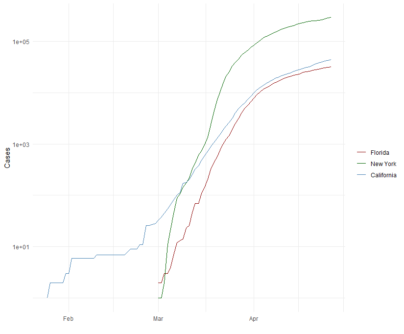

# Markdown Basics

## Favorite Foods
1. Pasta
2. Strawberries
3. Lima Beans

## Images

## Add a Quote
> Bigotry is the disease of ignorance, of morbid minds; enthusiasm of the free 
  and buoyant. education & free discussion are the antidotes of both.
  
> \- Thomas Jefferson, 1816

## Add an Equation
$P(A \mid B) = \frac{P(B \mid A)P(A)}{P(B)}$

## Add a Footnote
This is a footnote^[A footnote in R.].

## Add Citations
* R for Everyone [@lander2014r]
* Discovering Statistics Using R [@field2012discovering]


\
Figure 1: All Cases (Log Plot)

# Inline Code
```{r include = FALSE}
library(ggplot2)
heights_df <- read.csv("C:/Users/manzo/Documents/Bellevue/Classes/DSC 520/Personal GitHub/DSC520/data/r4ds/heights.csv")
covid_df <- read.csv("C:/Users/manzo/Documents/Bellevue/Classes/DSC 520/Personal GitHub/DSC520/data/nytimes/covid-19-data/us-states.csv")
covid_df$date <- as.Date(covid_df$date)
california_df <- covid_df[ which( covid_df$state == "California"), ]
ny_df <- covid_df[ which( covid_df$state == "New York"), ]
florida_df <- covid_df[ which( covid_df$state == "Florida"), ]
```

## NY Times COVID-19 Data
```{r echo=FALSE}
ggplot(data=covid_df, aes(x=date, group=1)) +
  geom_line(data=florida_df, aes(y = cases, colour = "Florida")) +
  geom_line(data=ny_df, aes(y = cases,colour="New York")) +
  geom_line(data=california_df, aes(y = cases, colour="California")) +
  scale_colour_manual("",
                      breaks = c("Florida", "New York", "California"),
                      values = c("darkred", "darkgreen", "steelblue")) +
  xlab(" ") + ylab("Cases") + scale_y_log10()
```

## R4DS Height vs Earnings
```{r echo=FALSE}
ggplot(heights_df, aes(x=height, y=earn, col=sex)) + geom_point() + ggtitle('Height vs. Earnings') + 
  xlab('Height (Inches)') + ylab('Earnings (Dollars)')
```

# Tables
```{r include=FALSE}
library(knitr)
name <- c("Aragon", "Bilbo", "Frodo", "Galadriel", "Sam", "Gandalf", "Legolas", "Sauron", "Gollum")
race <- c("Men", "Hobbit", "Hobbit", "Elf", "Hobbit", "Maia", "Elf", "Maia", "Hobbit")
in_fellowship <- c(TRUE, FALSE, TRUE, FALSE, TRUE, TRUE, TRUE, FALSE, FALSE)
ring_bearer <- c(FALSE, TRUE, TRUE, FALSE, TRUE, TRUE, FALSE, TRUE, TRUE)
age <- c(88, 129, 51, 7000, 36, 2019, 2931, 7052, 589)
characters_df <- data.frame(name, race, in_fellowship, ring_bearer, age)
```

## Knitr Table with Kable
```{r echo=FALSE}
kable(characters_df, caption="Table 1. One Ring to Rule Them All")
```

## Pandoc Table
```{r echo=FALSE, warning=FALSE, comment=NA}
library(pander)
chars1_df <- characters_df[1:3,]
chars2_df <- characters_df[5:5,]
chars3_df <- characters_df[8:8,]
characters_df <- rbind(chars1_df, chars2_df, chars3_df)
row.names(characters_df) <- NULL
pandoc.table(characters_df, style='grid')

```

# References
